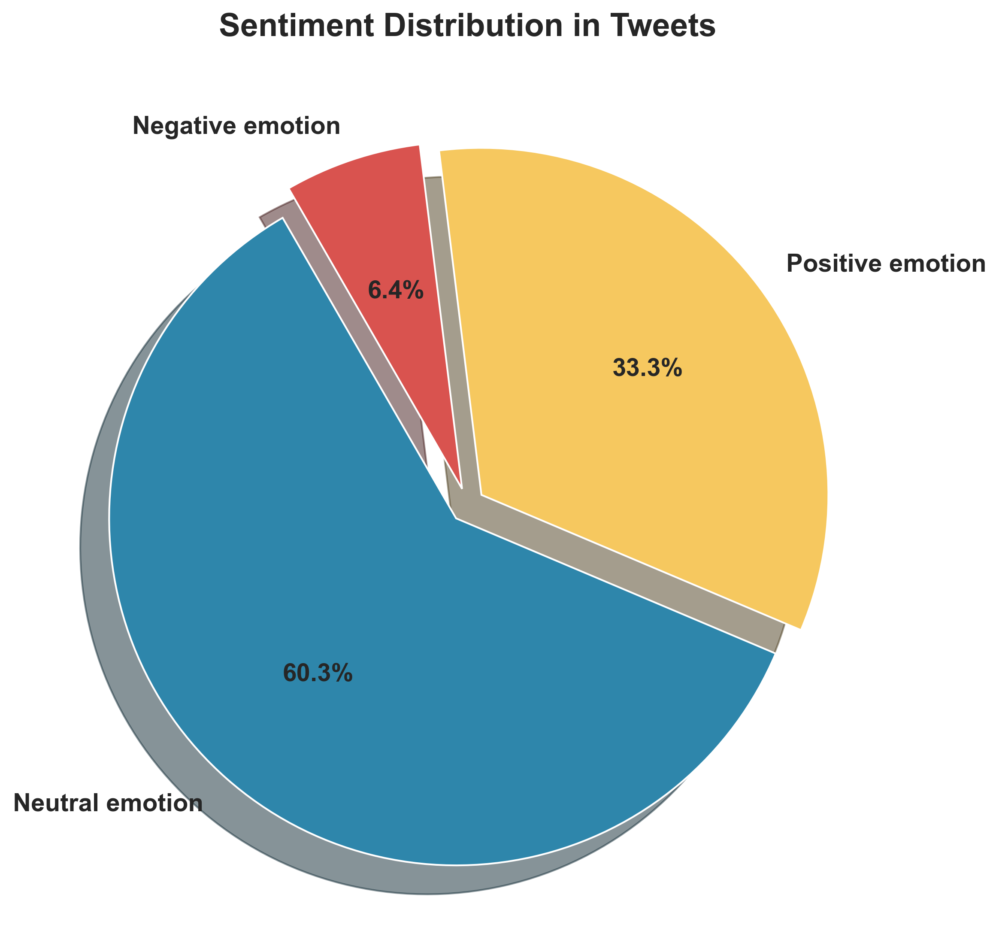
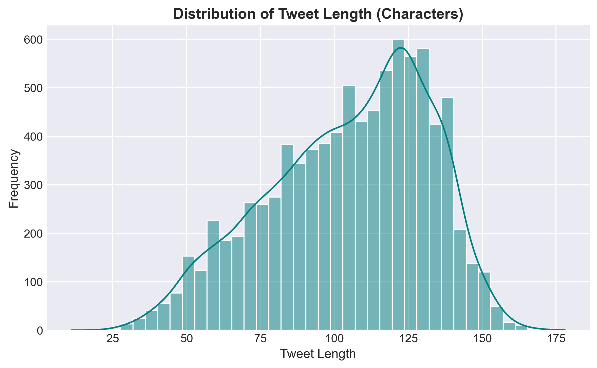
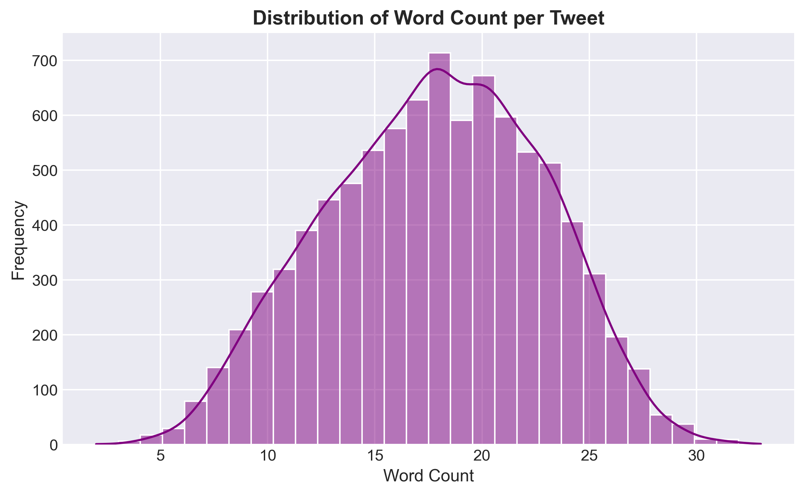
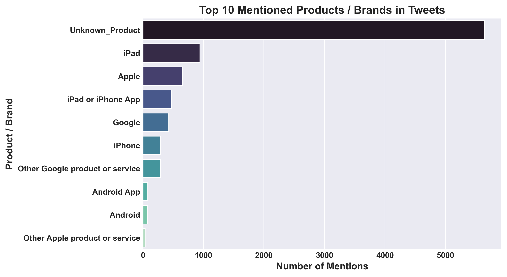
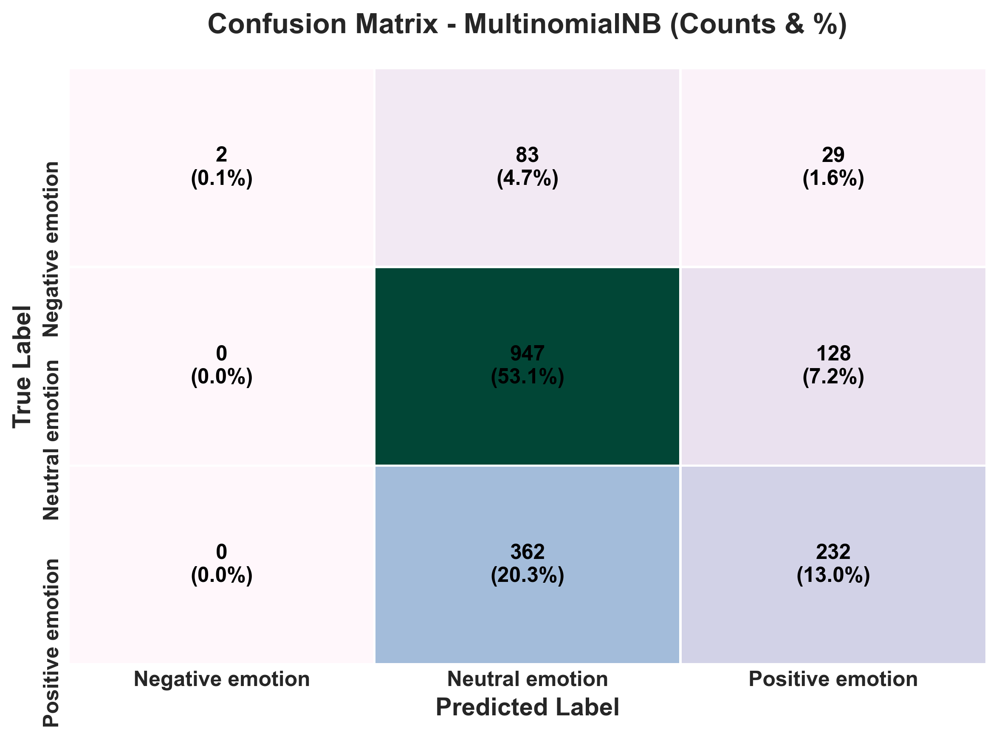

# Twitter Sentiment Analysis  
## An NLP and Machine Learning Study on Public Opinion of Apple and Google Products

  


**Author:** [Vilmarson JULES](mailto:vilmarsonjules22@gmail.com)

## Project Overview
---
  
This project focuses on **analyzing public sentiment about Apple and Google products using Twitter data**, two of the world’s leading technology companies. - **The ultimate goal is to gain insights into customer opinions and brand perception, helping companies understand how their products are received in the market.**  

The study demonstrates practical applications of NLP and data-driven decision making in real-world business contexts. And The analysis combines **Natural Language Processing (NLP) techniques with machine learning models** to automatically detect the sentiment expressed in social media posts.


## Business Problem
---


pple and Google need a clear understanding of how their products are perceived on social media, as opinions on Twitter can quickly influence brand reputation and customer behavior. Currently, monitoring and interpreting thousands of tweets manually is impractical, making it difficult for the companies to extract actionable insights in a timely manner.

The goal of this project is to help Apple and Google understand **public sentiment on Twitter**. Using NLP and machine learning, I classify tweets as positive, negative, or neutral, providing insights that allow the companies to identify trends, address concerns proactively, and make data-driven marketing and product decisions.


## The Data

---

**The dataset for this project is publicly available on : [data.world – CrowdFlower Twitter Sentiment Dataset](https://www.kaggle.com/datasets/becksddf/churn-in-telecoms-dataset)**

- It is provided in CSV format and contains tweets reflecting public opinion on Apple and Google products. Moreover, it captures overall public sentiment toward these products, which will be analyzed using NLP and machine learning techniques.
This dataset provides the foundation for extracting insights about customer opinions, identifying sentiment trends, and applying predictive models to classify new tweets.

## Methods
---


In this project, **we adopt a Predictive Analysis approach, focused on classification**, to analyze public sentiment about Apple and Google products on Twitter.  
This project follows a predictive modeling approach to classify tweets. The main steps are :

- **Data Preprocessing :** Prepare and clean tweet text.
- **Exploratory Data Analysis (EDA) :** Analyze sentiment distribution and Visualize trends.
- **Predictive Model Performance :** Develop and tune classification models.
- **Model Evaluation :** Assess model performance using key metrics and compare results.

## Business Understanding
---


This project analyzes public sentiment on Apple and Google products through Twitter.** Social media opinions directly impact brand perception, customer engagement, and business decisions. Using NLP and machine learning, tweets are classified as positive, negative, or neutral, revealing trends, patterns, and emerging concerns. **These insights enable companies to respond proactively, understand customer preferences, and make data-driven marketing and product decisions.**


## Exploratory Data Analysis (EDA)

---

Most tweets (~**60%**) express **no clear opinion**, while ~**33%** are **positive** and ~**6%** are **negative**. This shows that **neutral sentiment dominates**, but there is still substantial feedback on **Apple** and **Google** products for analysis. 



Tweet lengths are slightly right-skewed, and word counts are roughly normal, indicating the text content is well-suited for **NLP modeling**.





Among the top mentioned products, **Apple products** like **iPad** (**10%**) and **iPhone** (**3%**) dominate, followed by **Google** (**5%**) products. A large portion (**63%**) of tweets refers to **`Unknown_Product`**, which will be carefully considered in modeling. These insights suggest opportunities to explore **public sentiment trends** and extract **actionable opinions** for both brands.




## Predictive Model Performance
---
Evaluate the performance of predictive models designed to analyze and understand impact of tweets on products, highlighting key metrics, visualizations, and actionable insights that guide targeted retention strategies and optimize resource allocation.

- **Multinomial Naive Bayes** –  Model suitable for text data.
  
For the model, we provide the confusion matrix, evaluation metrics (accuracy, precision, recall, F1-score, AUC), and interpretations that connect model performance to actionable business decisions.

### Multinomial Naive Bayes - Model Performnace

The confusion matrix shows that most **neutral tweets** (middle row) are still correctly classified, while **negative tweets** (top row) are mostly misclassified as neutral, with only a few correctly predicted. **Positive tweets** (bottom row) are partially captured, but a large portion is also confused with neutral, reflecting that the model still exhibits bias toward the dominant neutral class.



The Multinomial Naive Bayes model accurately captures **neutral tweets** (around 88% recall) but struggles with **positive and negative tweets**, particularly negative ones.  


The overall accuracy has improved to around 76%, with a macro F1 score of 53%, reflecting better performance in capturing minority classes compared to the previous model. These results highlight that combining TF-IDF text features with engineered features (like tweet length, word count, and mentions of Apple/Google) helped improve predictions for underrepresented sentiments.

- ### Commentary and Remarks:

The Multinomial Naive Bayes model, while simple, demonstrates solid performance in detecting **neutral tweets**, but struggles to accurately classify **positive and negative tweets**, particularly negative ones. This pattern reflects the class imbalance in the dataset and the model's bias toward the dominant neutral category.  
In practical terms, the model can provide a general overview of sentiment trends, which is useful for high-level monitoring of public opinion. However, it may miss critical signals from extreme sentiments—both praise and complaints—limiting its effectiveness for targeted business actions.  

- ### Business Implication:

For practical monitoring of public sentiment, the current Multinomial Naive Bayes model is reliable for identifying **neutral tweets**, giving a general sense of overall sentiment trends.  

However, the model struggles with **positive and negative tweets**, meaning it may miss important signals such as customer praise or complaints. This limitation could impact timely business decisions, like addressing dissatisfaction or leveraging positive feedback.  


## Business Recommendations
---
#### 1. Monitor and Respond to Negative Sentiment.  
---

- **Detect Customer Complaints Early:**  
Although the model struggles with negative tweets, identifying them promptly allows the company to address dissatisfaction before it escalates. 

- **Prioritize High-Impact Issues:**  
By focusing on negative sentiment related to key products or services, the company can allocate resources efficiently. Not all complaints have the same urgency, so combining sentiment with context.

#### 2. Leverage Positive Sentiment for Marketing and Engagement.  
---

- **Amplify Customer Praise:**  
Positive tweets provide valuable insights into what customers appreciate most. Highlighting these experiences in marketing campaigns, social media can strengthen brand perception and attract new customers.

- **Encourage Advocacy:**  
Engage with users expressing positive sentiment to foster loyalty and word-of-mouth promotion. Responding to praise or creating campaigns around satisfied customers turns positive feedback into strategic business opportunities.

- **Focus on Profitability:**  
Combine churn predictions with customer lifetime value (CLV) to identify which at-risk customers are most valuable.  

- **Return on Retention Investments :**  
Direct retention efforts toward these customers to ensure budgets deliver the strongest financial impact, while using lighter strategies for lower-value accounts.  

#### 3. Leverage Sentiment Insights to Improve Customer Experience.  
---

- **Detect Pain Points Early:**  
Use the model to monitor negative sentiment in tweets to identify common complaints or dissatisfaction trends. This allows the company to act quickly before issues escalate.  

- **Enhance Product and Service Quality:**  
By systematically addressing the most frequent negative feedback, the company can improve products, services, or support processes. This strengthens customer trust, reduces churn, and builds a positive brand image.


#### 4. Personalize Marketing and Engagement Strategies Based on Sentiment.  
---

- **Tailor Communication to Customer Mood:**  

Use sentiment analysis to segment customers by positive, neutral, or negative feedback. This enables sending personalized messages.

- **Increase Marketing Efficiency and Loyalty:**  
Targeted communication ensures that campaigns resonate with the audience, improving conversion rates and customer satisfaction.


## Conclusion
---

This predictive analysis offers actionable insights into customer churn for the telecommunications sector, helping retain high-value clients and mitigate revenue loss.

### Key Insights & Results

---

- **Neutral sentiment dominates:** Most tweets are neutral, allowing the company to prioritize attention on tweets that show strong positive or negative opinions.  

- **Positive and negative sentiments are harder to capture:** Extreme opinions are less frequent and nuanced, suggesting the need for more advanced NLP methods or additional features to fully leverage these valuable signals.  

- **Moderate but actionable model performance:** With **66% accuracy** and a **42% macro F1 score**, the Multinomial Naive Bayes model provides a solid foundation to guide initial business decisions and highlight trends in customer sentiment.  

- **Enhanced predictive power through engineered features:** Including brand mentions (Apple, Google) and tweet characteristics (length, word count) improves the model’s ability to understand context beyond text alone.  

- **Business impact:** Insights from the model help identify areas of concern, track customer satisfaction trends, and inform proactive strategies to address complaints, amplify positive feedback, and monitor overall sentiment shifts.

**Summary:** This analysis equips the company with actionable insights to respond to customer sentiment effectively, optimize engagement strategies, and inform data-driven business decisions.

### Next Steps

---

- **Continuously Monitor Customer Sentiment:** Regularly track customer feedback and engagement to detect changes in sentiment trends and validate model performance over time.

- **Refine Predictive Models:** Periodically update and retrain the sentiment model with new data, exploring additional features, alternative algorithms, or advanced NLP techniques to enhance accuracy and capture minority sentiment classes.

- **Implement Targeted Engagement Strategies:** Leverage sentiment predictions to design personalized campaigns, address negative feedback promptly, and promote positive interactions with key customer segments.

- **Evaluate Business Impact:** Measure the effectiveness of interventions using metrics such as customer satisfaction, engagement improvement, and ROI, adjusting strategies based on results.

- **Integrate Insights into Operational Systems:** Embed sentiment scores and risk indicators into CRM or marketing platforms to support real-time decision-making by customer support, marketing, and management teams.


### Full Analysis & Contact
---
Explore the complete analytical workflow in the [Jupyter Notebook](./tweets_index.ipynb) or review the [presentation slides](./TweetsInsight_Presentation.pdf) for a high-level summary key findings and actionable recommendations.

For professional inquiries, collaboration opportunities, or discussions about the methodology and insights, reach out to:

**Vilmarson JULES**  
Data Science & AI Student  
📧 [vilmarsonjules22@gmail.com](mailto:vilmarsonjules22@gmail.com)  


## Repository Structure
---
```
ds-4-twitter-sentiment-analysis/
│
├── Data/
├── Images/
├── README.md
├── tweets_index.ipynb
└── TweetsInsight_Presentation.pdf
```

